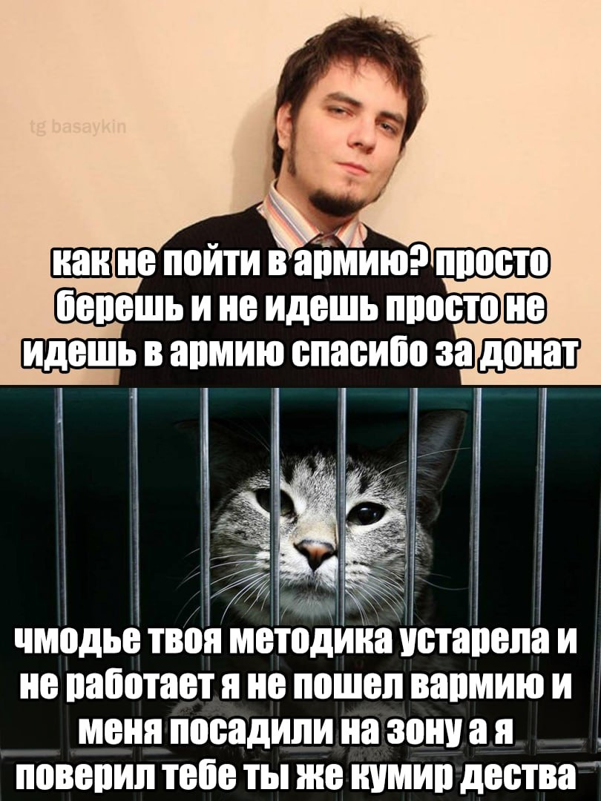
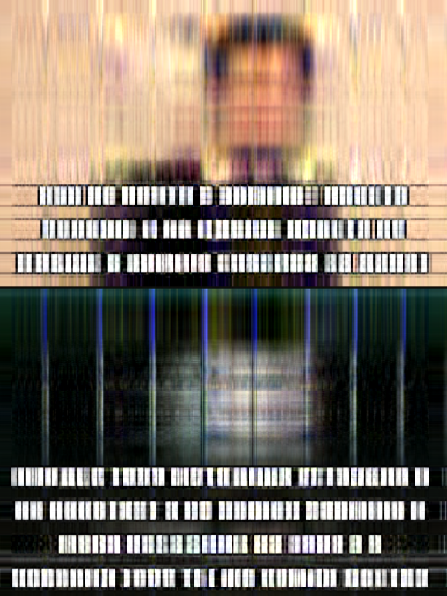
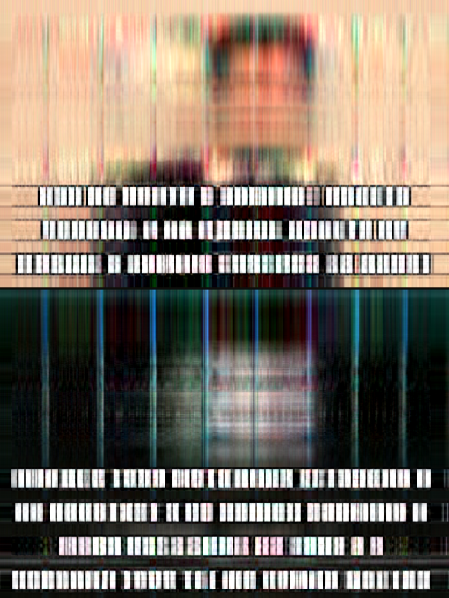

# Задача 3

Реализация сжатия изображений с использованием SVD

## Эксперимент

Рассматриваемые алгоритмы:
1. метод из библиотеки numpy
2. степенной метод (simple)
3. блочный степенной метод (advanced)

### Данные

Использованное изображение:

### Результаты:

Оценим сохранность фотографий после прогонки через разные методы сжатия:

| Algorithm | Compression lvl = 1 |
| --- | --- |
| numpy |  |
| simple |  |
| advanced |  |

При коэффициенте сжатия 1 лучше всего со сжатием (в плане сохранения качества изображения справляется numpy). 

| Algorithm | Compression lvl = 3 |
| --- | --- |
| numpy |  |
| simple |  |
| advanced |  |

Если увеличить уровень сжатия до 3, то разница в качестве всех 3 методов пропадает. 

| Algorithm | Compression lvl = 10 |
| --- | --- |
| numpy |  |
| simple |  |
| advanced |  |

При большом уровне компресии все изображения теряют информационную ценность.

### Вывод

Можно заметить, что при повышении уровня сжатия качество изображения ухудшается почти одинаково во всех случаях. Остается только рассуждать о скорости выполнения сжатия в каждом отдельном случае для выбора оптимального алгоритма. Результаты замеров исполнения каждого из методов записаны в `compression_times.txt`. Замеры производились с помощью утилиты `time`.

